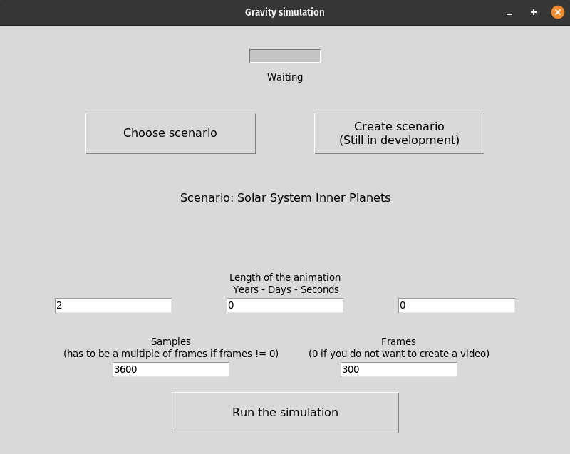

# Gravity simulation
This program allows you to run very simple gravity simulation for any given amount of bodies. It assumes each body can
be treated like a point and is based only on Newton's law of universal gravitation. It doesn't include relativistic
effects.

Each bodies' movement is calculated using the following formula

 

where:

-  - force
-  - Gravitational constant
-  - mass of body 1
-  - mass of body 2
-  - distance between the two bodies

## Running the program
The program is currently developed for python `3.9`. To run it you will need to download the following libraries:

- matplotlib
- numpy
- pandas
- opencv-python

To run the program you will need to download it onto you computer along with python and the listed libraries and run
the `gui.py` script.

## How it works
Firstly, click the 'Choose scenario' button, and choose the scenario of you choice. Then either change the settings or
leave them at default. Click 'Run the simulation' to run the simulation. After it's done, `./temp` folder should pop up
on your screen. If not, open the folder yourself (it's located where the program files are). All your files should be
there.

Settings description:
- Length of the animation - the timeframe for which the animation will simulate the motion.
- Samples - amount of steps the animation will take. Adding more samples will increase precision, but also make the
program run longer.
- Frames - amount of frames the video will consist of. Can be set to 0 if you wish not to create a video. Adding more
frames greatly increases the time the program will run, but also the RAM usage, so setting it too high will crash the
program (100 frames use approximately 1 GB of RAM). Video playback speed is 30fps, so 300 frames will result in a 10
seconds-long video.

## Adding custom scenarios
Adding your own scenarios is possible. You need to go to `./scenarios/default` and add your own scenarios in the format
shown in `./scenarios/FORMATTING.MD` file.

## Contributing
I created this project as a fun and simple coding challenge for myself. That being said, you are more than welcome to
contribute. You can either help by improving the code, adding new functionalities or creating new, interesting
scenarios.

## Requirements
Part of the script responsible for calculating motion and plotting graph should run on almost any computer. Problems may
occur with creating the video. Each frame uses approximately 4.5 MB and creating the video uses approximately 1 GB of
RAM per 100 frames, so make sure to keep that in mind when using the program. If it runs out of RAM it may freeze your
computer for a while and crash. If you want to create a video, but your computer can't handle it you can change the
'DPI' constant in `simulation.py`, to lower the resolution and therefore use less storage and RAM.

## Links

- [GitHub Repository](https://github.com/Galachard/Gravity-simulation)

## Author
**Krzysztof Król**

- [GitHub Profile](https://github.com/Galachard)

## License
This project is licensed under the MIT License.